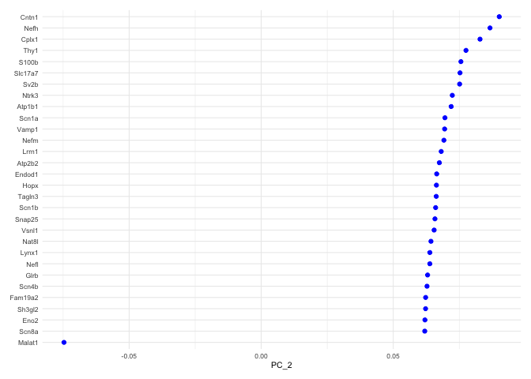
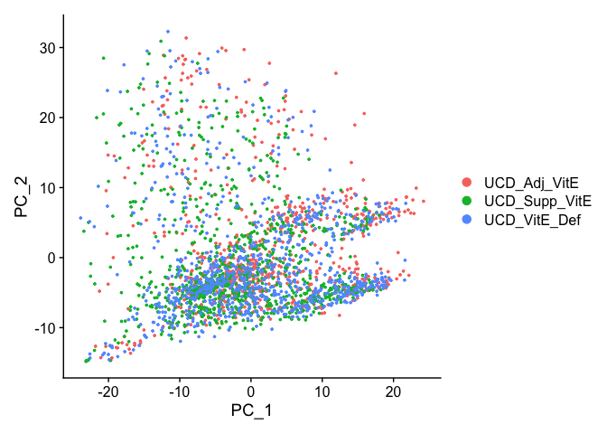
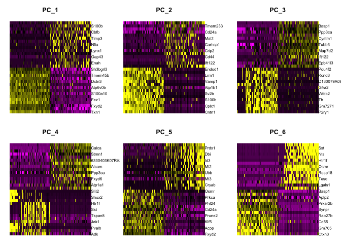
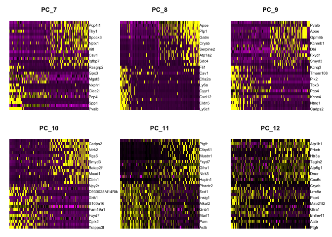
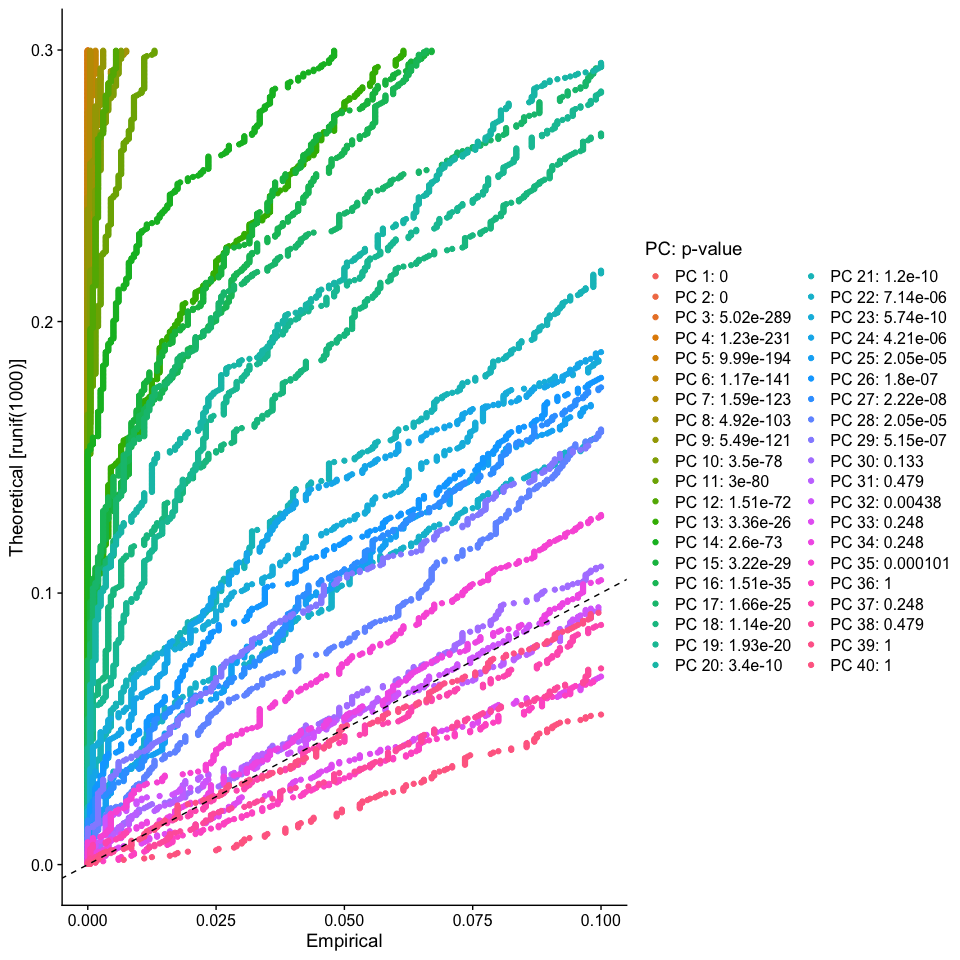

## Load libraries

```r
library(Seurat)
library(ggplot2)
```

## Load the Seurat object

```r
load(file="pre_sample_corrected.RData")
experiment.aggregate
```

<div class='r_output'> An object of class Seurat 
 12811 features across 2681 samples within 1 assay 
 Active assay: RNA (12811 features, 2000 variable features)
</div>

## Now doing so for 'real'

ScaleData - Scales and centers genes in the dataset. If variables are provided in vars.to.regress, they are individually regressed against each gene, and the resulting residuals are then scaled and centered unless otherwise specified. Here we regress out for sample (orig.ident) and percentage mitochondria (percent.mito).


```r
?ScaleData
experiment.aggregate <- ScaleData(
  object = experiment.aggregate,
  vars.to.regress = c("cell.cycle", "percent.mito"))
```

<div class='r_output'> Regressing out cell.cycle, percent.mito
</div>
<div class='r_output'> Centering and scaling data matrix
</div>
## Dimensionality reduction with PCA

Next we perform PCA (principal components analysis) on the scaled data.  


```r
?RunPCA
experiment.aggregate <- RunPCA(object = experiment.aggregate, features = VariableFeatures(object = experiment.aggregate))
```

<div class='r_output'> PC_ 1 
 Positive:  Txn1, Sncg, Fxyd2, Lxn, Fez1, Rgs10, S100a10, Synpr, Atp6v0b, Ppp1r1a 
 	   Dctn3, Ubb, Tmem45b, Rabac1, Sh3bgrl3, Tppp3, Atpif1, Hagh, Cisd1, Bex2 
 	   Atp6v1f, Bex3, Tmsb4x, Psmb6, Pfn1, Ndufa11, Aldoa, Anxa2, Ndufs5, Ppia 
 Negative:  Ptn, S100b, Cbfb, Sv2b, Mt1, Timp3, Ngfr, Nfia, Lynx1, Map2 
 	   Adcyap1, Gap43, Fxyd7, Enah, Thy1, Nefh, Scg2, Syt2, Nptn, Tmem229b 
 	   Faim2, Igfbp7, Kit, Zeb2, Nfib, Epb41l3, Slc17a7, Ryr2, Ncdn, Cntnap2 
 PC_ 2 
 Positive:  Cntn1, Nefh, Cplx1, Thy1, S100b, Slc17a7, Sv2b, Ntrk3, Atp1b1, Scn1a 
 	   Vamp1, Nefm, Lrrn1, Atp2b2, Endod1, Hopx, Tagln3, Scn1b, Snap25, Vsnl1 
 	   Nat8l, Nefl, Lynx1, Glrb, Scn4b, Sh3gl2, Fam19a2, Eno2, Scn8a, Cpne6 
 Negative:  Malat1, Tmem233, Cd9, Cd24a, Prkca, Mal2, Dusp26, Carhsp1, Gna14, Crip2 
 	   Osmr, Cd44, Tmem158, Ift122, Id3, Gadd45g, Calca, Camk2a, Cd82, Hs6st2 
 	   Ctxn3, Gm525, Emp3, S100a6, Nppb, Tac1, Socs2, Sst, Arpc1b, Crip1 
 PC_ 3 
 Positive:  P2ry1, Fam19a4, Gm7271, Rarres1, Th, Zfp521, Wfdc2, Tox3, Gfra2, Cdkn1a 
 	   D130079A08Rik, Rgs5, Kcnd3, Iqsec2, Pou4f2, Cd81, Cd34, Slc17a8, Rasgrp1, Casz1 
 	   Sorbs2, Id4, Dpp10, Piezo2, Zfhx3, Gm11549, Spink2, Igfbp7, Gabra1, Synpr 
 Negative:  Calca, Basp1, Map1b, Ppp3ca, Gap43, Cystm1, Scg2, Tubb3, Calm1, Map7d2 
 	   Ncdn, Ift122, Epb41l3, 6330403K07Rik, Skp1a, Tmem233, Nmb, Dusp26, Tmem255a, Resp18 
 	   Crip2, Ntrk1, Prkca, Tnfrsf21, Fxyd7, Ywhag, Deptor, Camk2a, Mt3, Camk2g 
 PC_ 4 
 Positive:  Adk, Etv1, Pvalb, Nsg1, Jak1, Tmem233, Tspan8, Nppb, Sst, Gm525 
 	   Htr1f, Slc17a7, Shox2, Spp1, Slit2, Cbln2, Nts, Osmr, Stxbp6, Cmtm8 
 	   Aldoc, Runx3, Cysltr2, Klf5, Fam19a2, Hapln4, Ptprk, Rasgrp2, Carhsp1, Atp1a3 
 Negative:  Gap43, Calca, Arhgdig, Stmn1, Tac1, 6330403K07Rik, Ngfr, Alcam, Kit, Ppp3ca 
 	   Smpd3, Adcyap1, Fxyd6, Ntrk1, Atp1a1, Tagln3, Gal, Tmem100, Gm7271, Chl1 
 	   Atp2b4, Mt3, Dclk1, S100a11, Tppp3, Fxyd7, Prune2, Fbxo2, Cnih2, Mgll 
 PC_ 5 
 Positive:  Fxyd2, Rgs4, Acpp, Cpne3, Klf5, Zfhx3, Prune2, Nbl1, Cd24a, Gnb1 
 	   Phf24, Dgkz, Parm1, Prkca, Osmr, Ywhag, Jak1, Tmem233, Kif5b, Synpr 
 	   Tspan8, Plxnc1, Dpp10, Casz1, P2ry1, Nppb, Ano3, Rasgrp1, Socs2, Arpc1b 
 Negative:  Mt1, Prdx1, Ptn, Dbi, B2m, Id3, Mt2, Sparc, Ifitm3, Ubb 
 	   Selenop, Mt3, Rgcc, Timp3, Cryab, Apoe, Uqcrb, Phlda1, Hspa1a, Tecr 
 	   Fxyd7, Dad1, Qk, Ier2, Ifitm2, Fxyd1, Spcs1, Selenom, Psmb2, Igfbp7
</div>
Seurat then provides a number of ways to visualize the PCA results

Visualize PCA loadings

```r
p <- VizDimLoadings(experiment.aggregate, dims = 1, ncol = 1)
p + theme_minimal(base_size = 8)
```

<!-- -->

```r
p <- VizDimLoadings(experiment.aggregate, dims = 2, ncol = 1)
p + theme_minimal(base_size = 8)
```

<!-- -->

Principal components plot

```r
DimPlot(
  object = experiment.aggregate, reduction = "pca")
```

<!-- -->

Draws a heatmap focusing on a principal component. Both cells and genes are sorted by their principal component scores. Allows for nice visualization of sources of heterogeneity in the dataset.


```r
DimHeatmap(object = experiment.aggregate, dims = 1:6, cells = 500, balanced = TRUE)
```

<!-- -->

```r
DimHeatmap(object = experiment.aggregate, dims = 7:12, cells = 500, balanced = TRUE)
```

<!-- -->

### Selecting which PCs to use
To overcome the extensive technical noise in any single gene, Seurat clusters cells based on their PCA scores, with each PC essentially representing a metagene that combines information across a correlated gene set. Determining how many PCs to include downstream is therefore an important step.

ElbowPlot plots the standard deviations (or approximate singular values if running PCAFast) of the principle components for easy identification of an elbow in the graph. This elbow often corresponds well with the significant PCs and is much faster to run.  This is the traditional approach to selecting principal components.


```r
ElbowPlot(experiment.aggregate)
```

<!-- -->

The JackStraw function randomly permutes a subset of data, and calculates projected PCA scores for these 'random' genes, then compares the PCA scores for the 'random' genes with the observed PCA scores to determine statistical signifance. End result is a p-value for each gene's association with each principal component. We identify significant PCs as those who have a strong enrichment of low p-value genes.

__WARNING: TAKES A LONG TIME TO RUN__

```r
experiment.aggregate <- JackStraw(
    object = experiment.aggregate, dims = 40)
```


```r
experiment.aggregate <- ScoreJackStraw(experiment.aggregate, dims = 1:40)
JackStrawPlot(object = experiment.aggregate, dims = 1:40)
```

<!-- -->

Looking at the results of the JackStraw plot, we determine to use the first 35 PCs

```r
use.pcs = 1:29
```

## Finally, lets save the filtered and normalized data

```r
save(experiment.aggregate, file="pca_sample_corrected.RData")
```

## Get the next Rmd file

```r
download.file("https://raw.githubusercontent.com/ucdavis-bioinformatics-training/2019-single-cell-RNA-sequencing-Workshop-UCD_UCSF/master/scrnaseq_analysis/scRNA_Workshop-PART5.Rmd", "scRNA_Workshop-PART5.Rmd")
```

## Session Information

```r
sessionInfo()
```

<div class='r_output'> R version 4.0.0 (2020-04-24)
 Platform: x86_64-apple-darwin17.0 (64-bit)
 Running under: macOS Catalina 10.15.4
 
 Matrix products: default
 BLAS:   /Library/Frameworks/R.framework/Versions/4.0/Resources/lib/libRblas.dylib
 LAPACK: /Library/Frameworks/R.framework/Versions/4.0/Resources/lib/libRlapack.dylib
 
 locale:
 [1] en_US.UTF-8/en_US.UTF-8/en_US.UTF-8/C/en_US.UTF-8/en_US.UTF-8
 
 attached base packages:
 [1] stats     graphics  grDevices datasets  utils     methods   base     
 
 other attached packages:
 [1] ggplot2_3.3.0 Seurat_3.1.5 
 
 loaded via a namespace (and not attached):
  [1] httr_1.4.1          tidyr_1.0.3         jsonlite_1.6.1     
  [4] viridisLite_0.3.0   splines_4.0.0       leiden_0.3.3       
  [7] assertthat_0.2.1    BiocManager_1.30.10 renv_0.10.0        
 [10] yaml_2.2.1          ggrepel_0.8.2       globals_0.12.5     
 [13] pillar_1.4.4        lattice_0.20-41     glue_1.4.1         
 [16] reticulate_1.15     digest_0.6.25       RColorBrewer_1.1-2 
 [19] colorspace_1.4-1    cowplot_1.0.0       htmltools_0.4.0    
 [22] Matrix_1.2-18       plyr_1.8.6          pkgconfig_2.0.3    
 [25] tsne_0.1-3          listenv_0.8.0       purrr_0.3.4        
 [28] patchwork_1.0.0     scales_1.1.1        RANN_2.6.1         
 [31] Rtsne_0.15          tibble_3.0.1        farver_2.0.3       
 [34] ellipsis_0.3.1      withr_2.2.0         ROCR_1.0-11        
 [37] pbapply_1.4-2       lazyeval_0.2.2      survival_3.1-12    
 [40] magrittr_1.5        crayon_1.3.4        evaluate_0.14      
 [43] future_1.17.0       nlme_3.1-147        MASS_7.3-51.5      
 [46] ica_1.0-2           tools_4.0.0         fitdistrplus_1.1-1 
 [49] data.table_1.12.8   lifecycle_0.2.0     stringr_1.4.0      
 [52] plotly_4.9.2.1      munsell_0.5.0       cluster_2.1.0      
 [55] irlba_2.3.3         compiler_4.0.0      rsvd_1.0.3         
 [58] rlang_0.4.6         grid_4.0.0          ggridges_0.5.2     
 [61] RcppAnnoy_0.0.16    htmlwidgets_1.5.1   igraph_1.2.5       
 [64] labeling_0.3        rmarkdown_2.1       gtable_0.3.0       
 [67] codetools_0.2-16    reshape2_1.4.4      R6_2.4.1           
 [70] gridExtra_2.3       zoo_1.8-8           knitr_1.28         
 [73] dplyr_0.8.5         uwot_0.1.8          future.apply_1.5.0 
 [76] KernSmooth_2.23-16  ape_5.3             stringi_1.4.6      
 [79] parallel_4.0.0      Rcpp_1.0.4.6        vctrs_0.3.0        
 [82] sctransform_0.2.1   png_0.1-7           tidyselect_1.1.0   
 [85] xfun_0.13           lmtest_0.9-37
</div>