## Load libraries

```r
library(Seurat)
library(ggplot2)
```

## Load the Seurat object

```r
load(file="pca_sample_corrected.RData")
experiment.aggregate
```

<div class='r_output'> An object of class Seurat 
 12811 features across 2681 samples within 1 assay 
 Active assay: RNA (12811 features, 2000 variable features)
  1 dimensional reduction calculated: pca
</div>
## Identifying clusters

Seurat implements an graph-based clustering approach. Distances between the cells are calculated based on previously identified PCs. Seurat approach was heavily inspired by recent manuscripts which applied graph-based clustering approaches to scRNAseq data. Briefly, Seurat identify clusters of cells by a shared nearest neighbor (SNN) modularity optimization based clustering algorithm. First calculate k-nearest neighbors (KNN) and construct the SNN graph. Then optimize the modularity function to determine clusters. For a full description of the algorithms, see Waltman and van Eck (2013) The European Physical Journal B.

The FindClusters function implements the procedure, and contains a resolution parameter that sets the granularity of the downstream clustering, with increased values leading to a greater number of clusters. I tend to like to perform a series of resolutions, investigate and choose.


```r
use.pcs = 1:29 

?FindNeighbors
experiment.aggregate <- FindNeighbors(experiment.aggregate, reduction="pca", dims = use.pcs)
```

<div class='r_output'> Computing nearest neighbor graph
</div>
<div class='r_output'> Computing SNN
</div>
```r
?FindCluster
```

<div class='r_output'> No documentation for 'FindCluster' in specified packages and libraries:
 you could try '??FindCluster'
</div>
```r
experiment.aggregate <- FindClusters(
    object = experiment.aggregate, 
    resolution = seq(0.25,4,0.25), 
    verbose = FALSE
)
```

Lets first investigate how many clusters each resolution produces and set it to the smallest resolutions of 0.5 (fewest clusters). 


```r
sapply(grep("res",colnames(experiment.aggregate@meta.data),value = TRUE),
       function(x) length(unique(experiment.aggregate@meta.data[,x])))
```

<div class='r_output'> RNA_snn_res.0.25  RNA_snn_res.0.5 RNA_snn_res.0.75    RNA_snn_res.1 
               10               14               15               16 
 RNA_snn_res.1.25  RNA_snn_res.1.5 RNA_snn_res.1.75    RNA_snn_res.2 
               18               20               24               24 
 RNA_snn_res.2.25  RNA_snn_res.2.5 RNA_snn_res.2.75    RNA_snn_res.3 
               25               26               27               28 
 RNA_snn_res.3.25  RNA_snn_res.3.5 RNA_snn_res.3.75    RNA_snn_res.4 
               28               28               28               29
</div>
```r
Idents(experiment.aggregate) <- "RNA_snn_res.0.5"
```

Finally,  lets produce a table of cluster to sample assignments.

```r
table(Idents(experiment.aggregate),experiment.aggregate$orig.ident)
```

<div class='r_output'>     
      UCD_Adj_VitE UCD_Supp_VitE UCD_VitE_Def
   0           157           171          156
   1           120           142          107
   2            78           118          159
   3            93            81           94
   4            55            77           86
   5            60            67           65
   6            51            79           62
   7            49            51           45
   8            23            45           39
   9            34            33           38
   10           20            30           20
   11           30            19           17
   12           18            20           19
   13           20            14           19
</div>
tSNE dimensionality reduction plots are then used to visualise clustering results. As input to the tSNE, you should use the same PCs as input to the clustering analysis.


```r
experiment.aggregate <- RunTSNE(
  object = experiment.aggregate,
  reduction.use = "pca",
  dims.use = use.pcs,
  do.fast = TRUE)
```

Plot TSNE coloring by the slot 'ident' (default).

```r
DimPlot(object = experiment.aggregate, pt.size=0.5, reduction = "tsne", label = T)
```

<div class='r_output'> Warning: Using `as.character()` on a quosure is deprecated as of rlang 0.3.0.
 Please use `as_label()` or `as_name()` instead.
 This warning is displayed once per session.
</div>
<!-- -->


Plot TSNE coloring by the clustering resolution 4

```r
DimPlot(object = experiment.aggregate, group.by="RNA_snn_res.4", pt.size=0.5, reduction = "tsne", label = T)
```

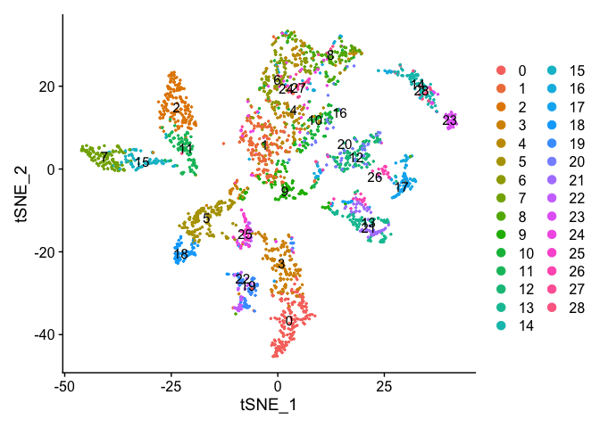<!-- -->

uMAP dimensionality reduction plot.


```r
experiment.aggregate <- RunUMAP(
  object = experiment.aggregate,
  dims = use.pcs)
```

<div class='r_output'> Warning: The default method for RunUMAP has changed from calling Python UMAP via reticulate to the R-native UWOT using the cosine metric
 To use Python UMAP via reticulate, set umap.method to 'umap-learn' and metric to 'correlation'
 This message will be shown once per session
</div>
<div class='r_output'> 07:41:54 UMAP embedding parameters a = 0.9922 b = 1.112
</div>
<div class='r_output'> 07:41:54 Read 2681 rows and found 29 numeric columns
</div>
<div class='r_output'> 07:41:54 Using Annoy for neighbor search, n_neighbors = 30
</div>
<div class='r_output'> 07:41:54 Building Annoy index with metric = cosine, n_trees = 50
</div>
<div class='r_output'> 0%   10   20   30   40   50   60   70   80   90   100%
</div>
<div class='r_output'> [----|----|----|----|----|----|----|----|----|----|
</div>
<div class='r_output'> **************************************************|
 07:41:55 Writing NN index file to temp file /var/folders/74/h45z17f14l9g34tmffgq9nkw0000gn/T//RtmpvxH7UJ/file9d173360a454
 07:41:55 Searching Annoy index using 1 thread, search_k = 3000
 07:41:55 Annoy recall = 100%
 07:41:55 Commencing smooth kNN distance calibration using 1 thread
 07:41:56 Initializing from normalized Laplacian + noise
 07:41:56 Commencing optimization for 500 epochs, with 107536 positive edges
 07:41:59 Optimization finished
</div>
Plot uMap coloring by the slot 'ident' (default).

```r
DimPlot(object = experiment.aggregate, pt.size=0.5, reduction = "umap", label = T)
```

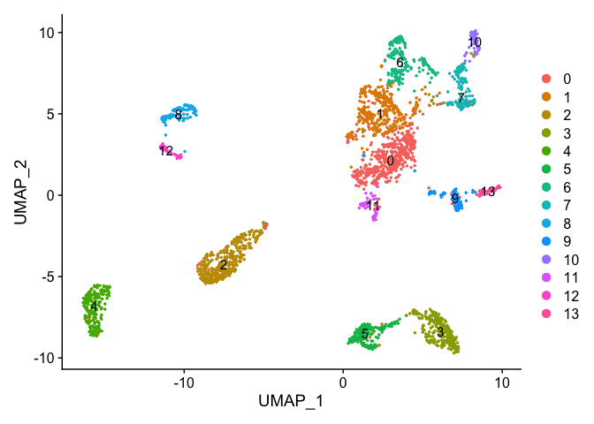<!-- -->


FeaturePlot can be used to color cells with a 'feature', non categorical data, like number of UMIs

```r
FeaturePlot(experiment.aggregate, features = c('nCount_RNA'), pt.size=0.5)
```

<!-- -->
and number of genes present

```r
FeaturePlot(experiment.aggregate, features = c('nFeature_RNA'), pt.size=0.5)
```

<!-- -->

percent mitochondrial 

```r
FeaturePlot(experiment.aggregate, features = c('percent.mito'), pt.size=0.5)
```

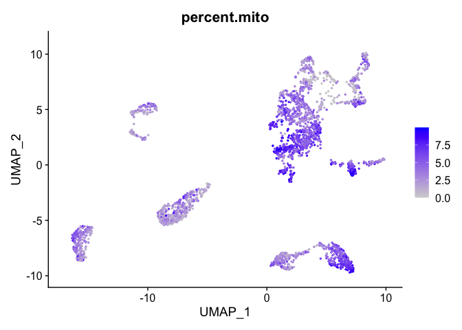<!-- -->

TSNE plot by cell cycle

```r
DimPlot(object = experiment.aggregate, pt.size=0.5, group.by = "cell.cycle", reduction = "tsne" )
```

<!-- -->


## Building  a  tree relating the 'average' cell from each cluster. Tree is estimated based on a distance matrix constructed in either gene expression space or PCA space.


```r
experiment.aggregate <- BuildClusterTree(
  experiment.aggregate, dims = use.pcs)

PlotClusterTree(experiment.aggregate)
```

<!-- -->


```r
DimPlot(object = experiment.aggregate, pt.size=0.5, label = TRUE, reduction = "tsne")
```

<!-- -->

Merge Clustering results

```r
experiment.merged = experiment.aggregate
# originally set clusters to resolutionm 0.5
Idents(experiment.merged) <- "RNA_snn_res.0.5"

table(Idents(experiment.merged))
```

<div class='r_output'> 
   0   1   2   3   4   5   6   7   8   9  10  11  12  13 
 484 369 355 268 218 192 192 145 107 105  70  66  57  53
</div>
```r
# based on TSNE and Heirarchical tree
# merge clusters 6 and 7 into 0 and cluster 9 into 13
experiment.merged <- RenameIdents(
  object = experiment.merged,
  '6' = '0', '7' = '0', '9' = '13'
)

table(Idents(experiment.merged))
```

<div class='r_output'> 
   0  13   1   2   3   4   5   8  10  11  12 
 821 158 369 355 268 218 192 107  70  66  57
</div>
```r
DimPlot(object = experiment.merged, pt.size=0.5, label = T, reduction = "tsne")
```

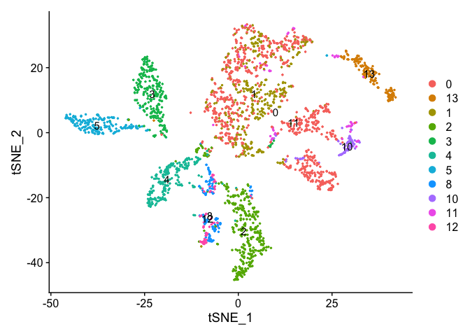<!-- -->

```r
experiment.examples <- experiment.merged
# in order to reporder the clusters for plotting purposes
# take a look at the levels, which indicates the ordering
levels(experiment.examples@active.ident)
```

<div class='r_output'>  [1] "0"  "13" "1"  "2"  "3"  "4"  "5"  "8"  "10" "11" "12"
</div>
```r
# relevel setting 5 to the first factor
experiment.examples@active.ident <- relevel(experiment.examples@active.ident, "5")
levels(experiment.examples@active.ident)
```

<div class='r_output'>  [1] "5"  "0"  "13" "1"  "2"  "3"  "4"  "8"  "10" "11" "12"
</div>
```r
# now cluster 5 is the "first" factor

# relevel all the factors to the order I want
Idents(experiment.examples) <- factor(experiment.examples@active.ident, levels=c("5","13","1","2","3","0","4","8","11","12","10","14"))
levels(experiment.examples@active.ident)
```

<div class='r_output'>  [1] "5"  "13" "1"  "2"  "3"  "0"  "4"  "8"  "11" "12" "10"
</div>
```r
DimPlot(object = experiment.examples, pt.size=0.5, label = T, reduction = "tsne")
```

<!-- -->

```r
### Re-assign clustering result to resolution 4 for cells in cluster 0 (@ reslution 0.5) [adding a R prefix]
newIdent = as.character(Idents(experiment.examples))
newIdent[newIdent == '0'] = paste0("R",as.character(experiment.examples$RNA_snn_res.4[newIdent == '0']))

Idents(experiment.examples) <- as.factor(newIdent)

table(Idents(experiment.examples))
```

<div class='r_output'> 
   1  10  11  12  13   2   3   4   5   8  R1 R10 R11 R12 R13 R14 R16 R20 R21 R26 
 369  70  66  57 158 355 268 218 192 107 172   2   1  92  83   1   5  59  58  42 
 R27 R28  R6  R8  R9 
  32   1 145 105  23
</div>
```r
DimPlot(object = experiment.examples, pt.size=0.5, label = T, reduction = "tsne")
```

<!-- -->

Plot TSNE coloring by the slot 'orig.ident' (sample names) with alpha colors turned on.

```r
DimPlot(object = experiment.aggregate, group.by="orig.ident", pt.size=0.5, reduction = "tsne" )
```

<!-- -->

```r
## Pretty tsne using alpha
p <- DimPlot(object = experiment.aggregate, group.by="orig.ident", pt.size=0.5, reduction = "tsne")
alpha.use <- 2/5
p$layers[[1]]$mapping$alpha <- alpha.use
p + scale_alpha_continuous(range = alpha.use, guide = F)
```

<!-- -->

Removing cells assigned to clusters from a plot, So here plot all clusters but clusters "3" and "5"

```r
# create a new tmp object with those removed 
experiment.aggregate.tmp <- experiment.aggregate[,-which(Idents(experiment.aggregate) %in% c("3","5"))]

dim(experiment.aggregate)
```

<div class='r_output'> [1] 12811  2681
</div>
```r
dim(experiment.aggregate.tmp)
```

<div class='r_output'> [1] 12811  2221
</div>
```r
DimPlot(object = experiment.aggregate.tmp, group.by="orig.ident", pt.size=0.5, reduction = "tsne", label = T)
```

<!-- -->

## Identifying Marker Genes

Seurat can help you find markers that define clusters via differential expression.

`FindMarkers` identifies markers for a cluster relative to all other clusters.

`FindAllMarkers` does so for all clusters

`FindAllMarkersNode` defines all markers that split a Node __(Warning: need to validate)__


```r
?FindMarkers

markers = FindMarkers(experiment.merged, ident.1=c(10), genes.use = VariableFeatures(experiment.merged))

head(markers)
```

<div class='r_output'>                  p_val avg_logFC pct.1 pct.2     p_val_adj
 Baiap2l1 7.352739e-235 1.1954540 0.714 0.014 9.419593e-231
 Cadps2   4.448365e-198 2.3426788 0.971 0.051 5.698801e-194
 Tbx3os2  1.753416e-182 0.6699683 0.443 0.005 2.246301e-178
 Cbln2    1.849806e-152 1.1941476 0.786 0.038 2.369787e-148
 Ntng1    1.302871e-150 1.0795688 0.686 0.028 1.669108e-146
 Ntrk2    1.157467e-148 2.0506117 0.971 0.074 1.482831e-144
</div>
```r
dim(markers)
```

<div class='r_output'> [1] 1474    5
</div>
```r
table(markers$avg_logFC > 0)
```

<div class='r_output'> 
 FALSE  TRUE 
   688   786
</div>
 
pct.1 and pct.2 are the proportion of cells with expression above 0 in ident.1 and ident.2 respectively. p_val is the raw p_value associated with the differntial expression test with adjusted value in p_val_adj. avg_logFC is the average log fold change difference between the two groups. 
 
avg_diff (lines 130, 193 and) appears to be the difference in log(x = mean(x = exp(x = x) - 1) + 1) between groups.  It doesn’t seem like this should work out to be the signed ratio of pct.1 to pct.2 so I must be missing something.  It doesn’t seem to be related at all to how the p-values are calculated so maybe it doesn’t matter so much, and the sign is probably going to be pretty robust to how expression is measured.

Can use a violin plot to visualize the expression pattern of some markers

```r
VlnPlot(object = experiment.merged, features = rownames(markers)[1:2], pt.size = 0.05)
```

<!-- -->

Or a feature plot

```r
FeaturePlot(
    experiment.merged, 
    head(rownames(markers), n=6), 
    cols = c("lightgrey", "blue"), 
    ncol = 2
)
```

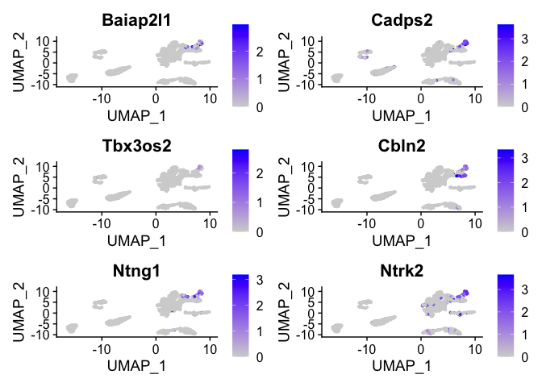<!-- -->

```r
FeaturePlot(    
    experiment.merged, 
    "Fxyd1", 
    cols = c("lightgrey", "blue") 
)
```

<!-- -->

FindAllMarkers can be used to automate the process across all genes.
__WARNING: TAKES A LONG TIME TO RUN__


```r
markers_all <- FindAllMarkers(
    object = experiment.merged, 
    only.pos = TRUE, 
    min.pct = 0.25, 
    thresh.use = 0.25
)
```

<div class='r_output'> Calculating cluster 0
</div>
<div class='r_output'> Calculating cluster 13
</div>
<div class='r_output'> Calculating cluster 1
</div>
<div class='r_output'> Calculating cluster 2
</div>
<div class='r_output'> Calculating cluster 3
</div>
<div class='r_output'> Calculating cluster 4
</div>
<div class='r_output'> Calculating cluster 5
</div>
<div class='r_output'> Calculating cluster 8
</div>
<div class='r_output'> Calculating cluster 10
</div>
<div class='r_output'> Calculating cluster 11
</div>
<div class='r_output'> Calculating cluster 12
</div>
```r
dim(markers_all)
```

<div class='r_output'> [1] 4558    7
</div>
```r
head(markers_all)
```

<div class='r_output'>                 p_val avg_logFC pct.1 pct.2     p_val_adj cluster    gene
 Fxyd7   1.080507e-195 1.8236300 0.622 0.095 1.384238e-191       0   Fxyd7
 Epb41l3 8.105698e-137 0.9447680 0.886 0.646 1.038421e-132       0 Epb41l3
 Pcp4    8.134008e-117 1.1867777 0.622 0.202 1.042048e-112       0    Pcp4
 Syt2     4.075036e-95 0.7285700 0.317 0.034  5.220529e-91       0    Syt2
 Ppp3ca   7.953394e-94 0.7186081 0.932 0.827  1.018909e-89       0  Ppp3ca
 Map1b    7.038770e-93 0.7138478 0.906 0.834  9.017368e-89       0   Map1b
</div>
```r
table(table(markers_all$gene))
```

<div class='r_output'> 
    1    2    3    4    5    6 
 1460  735  355  107   21    5
</div>
```r
markers_all_single <- markers_all[markers_all$gene %in% names(table(markers_all$gene))[table(markers_all$gene) == 1],]

dim(markers_all_single)
```

<div class='r_output'> [1] 1460    7
</div>
```r
table(table(markers_all_single$gene))
```

<div class='r_output'> 
    1 
 1460
</div>
```r
table(markers_all_single$cluster)
```

<div class='r_output'> 
   0  13   1   2   3   4   5   8  10  11  12 
  98 102  93 113 101 143 259  51 372  16 112
</div>
```r
head(markers_all_single)
```

<div class='r_output'>               p_val avg_logFC pct.1 pct.2    p_val_adj cluster   gene
 Syt2   4.075036e-95 0.7285700 0.317 0.034 5.220529e-91       0   Syt2
 Map1b  7.038770e-93 0.7138478 0.906 0.834 9.017368e-89       0  Map1b
 Pou4f3 3.681679e-70 0.7213944 0.253 0.032 4.716599e-66       0 Pou4f3
 Faim2  1.249016e-64 0.6612418 0.262 0.041 1.600115e-60       0  Faim2
 Clec2l 1.678623e-56 0.9394917 0.252 0.048 2.150484e-52       0 Clec2l
 Bcl11b 4.229328e-55 0.6431914 0.263 0.053 5.418192e-51       0 Bcl11b
</div>
Plot a heatmap of genes by cluster for the top 5 marker genes per cluster

```r
library(dplyr)
```

<div class='r_output'> 
 Attaching package: 'dplyr'
</div>
<div class='r_output'> The following objects are masked from 'package:stats':
 
     filter, lag
</div>
<div class='r_output'> The following objects are masked from 'package:base':
 
     intersect, setdiff, setequal, union
</div>
```r
top5 <- markers_all_single %>% group_by(cluster) %>% top_n(5, avg_logFC)
dim(top5)
```

<div class='r_output'> [1] 55  7
</div>
```r
DoHeatmap(
    object = experiment.merged, 
    features = top5$gene
) 
```

<div class='r_output'> Warning in DoHeatmap(object = experiment.merged, features = top5$gene): The
 following features were omitted as they were not found in the scale.data slot
 for the RNA assay: Mest, Chd5, Nwd2, Pik3r1, Nrsn1, Nrip1
</div>
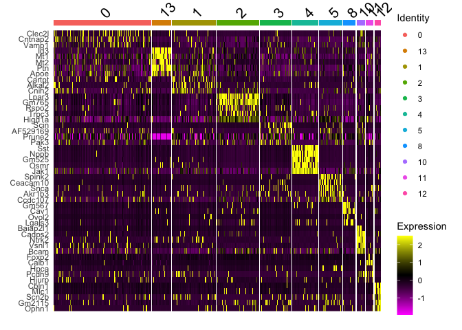<!-- -->


```r
# Get expression of genes for cells in and out of each cluster
getGeneClusterMeans <- function(gene, cluster){
  x <- GetAssayData(experiment.merged)[gene,]
  m <- tapply(x, ifelse(Idents(experiment.merged) == cluster, 1, 0), mean)
  mean.in.cluster <- m[2]
  mean.out.of.cluster <- m[1]
  return(list(mean.in.cluster = mean.in.cluster, mean.out.of.cluster = mean.out.of.cluster))
}

## for sake of time only using first six (head)
means <- mapply(getGeneClusterMeans, head(markers_all[,"gene"]), head(markers_all[,"cluster"]))
means <- matrix(unlist(means), ncol = 2, byrow = T)

colnames(means) <- c("mean.in.cluster", "mean.out.of.cluster")
rownames(means) <- head(markers_all[,"gene"])
markers_all2 <- cbind(head(markers_all), means)
head(markers_all2)
```

<div class='r_output'>                 p_val avg_logFC pct.1 pct.2     p_val_adj cluster    gene
 Fxyd7   1.080507e-195 1.8236300 0.622 0.095 1.384238e-191       0   Fxyd7
 Epb41l3 8.105698e-137 0.9447680 0.886 0.646 1.038421e-132       0 Epb41l3
 Pcp4    8.134008e-117 1.1867777 0.622 0.202 1.042048e-112       0    Pcp4
 Syt2     4.075036e-95 0.7285700 0.317 0.034  5.220529e-91       0    Syt2
 Ppp3ca   7.953394e-94 0.7186081 0.932 0.827  1.018909e-89       0  Ppp3ca
 Map1b    7.038770e-93 0.7138478 0.906 0.834  9.017368e-89       0   Map1b
         mean.in.cluster mean.out.of.cluster
 Fxyd7         1.6798649          0.19407543
 Epb41l3       2.3404669          1.23177418
 Pcp4          1.7363581          0.46152834
 Syt2          0.4960596          0.05270559
 Ppp3ca        2.8546865          1.98236564
 Map1b         2.8048819          2.04237303
</div>
## Finishing up clusters.

At this point in time you should use the tree, markers, domain knowledge, and goals to finalize your clusters. This may mean adjusting PCA to use, mergers clusters together, choosing a new resolutions, etc. When finished you can further name it cluster by something more informative. Ex.

```r
experiment.clusters <- experiment.aggregate
experiment.clusters <- RenameIdents(
  object = experiment.clusters,
  '0' = 'cell_type_A',
  '1' = 'cell_type_B',
  '2' = 'cell_type_C'
)
# and so on

DimPlot(object = experiment.clusters, pt.size=0.5, label = T, reduction = "tsne")
```

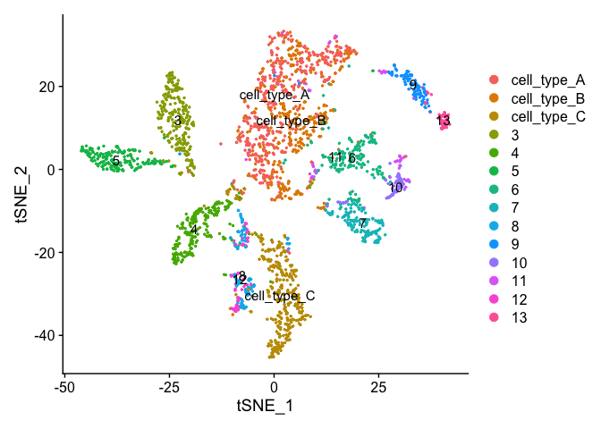<!-- -->

```r
experiment.merged$finalcluster <- Idents(experiment.merged)
```

## Subsetting samples
If you want to look at the representation of just one sample, or sets of samples

```r
experiment.sample2 <- subset(experiment.merged, orig.ident == "UCD_Supp_VitE")

DimPlot(object = experiment.sample2, group.by = "RNA_snn_res.0.5", pt.size=0.5, label = TRUE, reduction = "tsne")
```

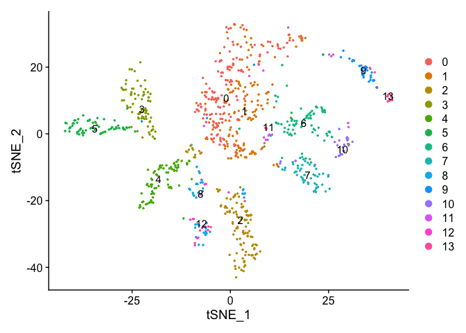<!-- -->

```r
FeaturePlot(experiment.sample2, features =c('Calca'), pt.size=0.5)
```

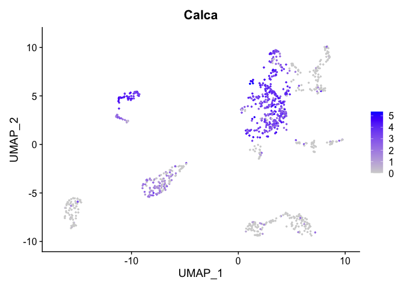<!-- -->

```r
FeaturePlot(experiment.sample2, features =c('Adcyap1'), pt.size=0.5)
```

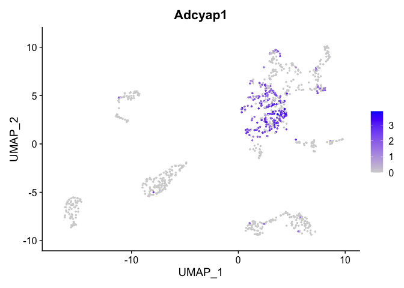<!-- -->

```r
experiment.batch1 <- subset(experiment.merged, batchid == "Batch1")

DimPlot(object = experiment.batch1, group.by = "RNA_snn_res.0.5", pt.size=0.5, label = TRUE, reduction = "tsne")
```

<!-- -->

### Adding in a new metadata column representing samples within clusters


```r
experiment.merged$samplecluster = paste(experiment.merged$orig.ident,experiment.merged$finalcluster,sep = '-')

# set the identity to the new variable 
Idents(experiment.merged) <- "samplecluster"

markers.comp <- FindMarkers(experiment.merged, ident.1 = "UCD_Adj_VitE-0", ident.2= c("UCD_Supp_VitE-0","UCD_VitE_Def-0"))

markers.comp
```

<div class='r_output'>                 p_val  avg_logFC pct.1 pct.2    p_val_adj
 Actb     8.861881e-10 -0.5673947 0.992 0.977 1.135296e-05
 Rpl21    7.774848e-08  0.3881549 0.864 0.706 9.960357e-04
 Pcp4     4.741533e-07  0.4131801 0.735 0.571 6.074377e-03
 Rpl23a   2.021054e-06  0.2894962 0.895 0.766 2.589172e-02
 Rpl17    2.608916e-06  0.2684048 0.860 0.722 3.342283e-02
 Eif3f    1.326337e-05  0.2665792 0.716 0.546 1.699171e-01
 Gpx3     1.765717e-05  0.3159426 0.405 0.243 2.262061e-01
 Wdfy1    2.520164e-05 -0.2918401 0.058 0.167 3.228583e-01
 Arhgap15 3.719021e-05  0.2894767 0.257 0.137 4.764438e-01
 S100a11  4.095142e-05  0.2800170 0.296 0.167 5.246287e-01
 Dbpht2   1.257523e-04  0.2664507 0.381 0.245 1.000000e+00
 Zfp467   2.451262e-04  0.2537192 0.152 0.071 1.000000e+00
 Arf3     9.047709e-04 -0.2881535 0.599 0.649 1.000000e+00
 Abhd2    1.222027e-03 -0.6137435 0.409 0.493 1.000000e+00
 Cartpt   1.472543e-03  0.3209726 0.202 0.115 1.000000e+00
 Polr2f   2.437619e-03  0.2545627 0.253 0.167 1.000000e+00
 Vdac1    3.202511e-03 -0.2773691 0.518 0.574 1.000000e+00
 Mt2      3.830778e-03  0.2982468 0.222 0.140 1.000000e+00
 Ndn      6.667147e-03  0.2547047 0.393 0.303 1.000000e+00
 Cbx3     8.925948e-03 -0.3627569 0.354 0.418 1.000000e+00
 Tagln2   9.775257e-03 -0.2702790 0.066 0.126 1.000000e+00
 Cadm3    1.275191e-02 -0.2684285 0.253 0.326 1.000000e+00
 Pspc1    1.379649e-02 -0.2637400 0.070 0.124 1.000000e+00
 Eno2     1.992050e-02 -0.2610868 0.490 0.543 1.000000e+00
 Necab1   2.091664e-02 -0.3307004 0.148 0.209 1.000000e+00
 Mt1      2.212451e-02  0.2748391 0.580 0.482 1.000000e+00
 Fam168b  2.295118e-02 -0.2826729 0.226 0.285 1.000000e+00
 Lix1     2.510876e-02 -0.3550222 0.237 0.291 1.000000e+00
 S100a16  2.539679e-02 -0.3021223 0.105 0.161 1.000000e+00
 Ptgir    3.874847e-02 -0.2614559 0.070 0.113 1.000000e+00
 Ddhd1    4.619008e-02 -0.2977759 0.187 0.239 1.000000e+00
 Srrm2    5.308238e-02 -0.2572114 0.342 0.388 1.000000e+00
 Rere     5.664667e-02 -0.2638236 0.179 0.230 1.000000e+00
 Clasp2   5.884710e-02 -0.3059209 0.214 0.264 1.000000e+00
 Etv5     6.361715e-02 -0.2762539 0.179 0.225 1.000000e+00
 Zbtb4    6.483122e-02 -0.2652181 0.284 0.328 1.000000e+00
 Birc6    7.223208e-02 -0.2824634 0.163 0.207 1.000000e+00
 Hdlbp    7.359119e-02 -0.3340025 0.222 0.261 1.000000e+00
 Nat8l    8.014531e-02 -0.2993328 0.346 0.381 1.000000e+00
 Ythdf2   1.112498e-01 -0.2643991 0.276 0.312 1.000000e+00
 Nfia     1.960180e-01 -0.2508155 0.323 0.348 1.000000e+00
 Bhlhe41  2.841893e-01 -0.2688964 0.389 0.404 1.000000e+00
 Pam      3.461588e-01 -0.3386852 0.467 0.468 1.000000e+00
 Wtap     3.912595e-01 -0.2518234 0.366 0.372 1.000000e+00
 Setd3    5.982182e-01 -0.2640513 0.323 0.312 1.000000e+00
 Plp1     6.189997e-01 -0.2627386 0.144 0.151 1.000000e+00
</div>
```r
experiment.subset <- subset(experiment.merged, samplecluster %in%  c( "UCD_Adj_VitE-0", "UCD_Supp_VitE-0" ))
DoHeatmap(experiment.subset, features = rownames(markers.comp))
```

<div class='r_output'> Warning in DoHeatmap(experiment.subset, features = rownames(markers.comp)):
 The following features were omitted as they were not found in the scale.data
 slot for the RNA assay: Setd3, Wtap, Ythdf2, Hdlbp, Birc6, Zbtb4, Clasp2, Rere,
 Srrm2, Ddhd1, Fam168b, Necab1, Pspc1, Vdac1, Polr2f, Arf3, Zfp467, Arhgap15,
 Wdfy1, Eif3f, Rpl17, Rpl23a, Rpl21
</div>
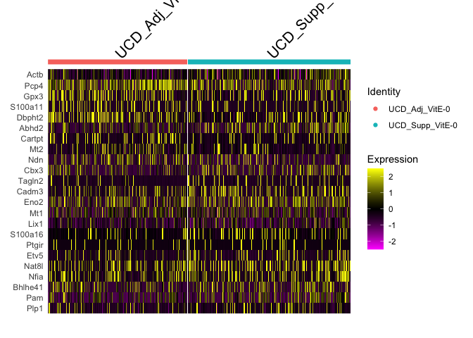<!-- -->

```r
Idents(experiment.merged) <- "finalcluster"
```

And last lets save all the objects in our session.

```r
save(list=ls(), file="clusters_seurat_object.RData")
```

## Get the next Rmd file

```r
download.file("https://raw.githubusercontent.com/ucdavis-bioinformatics-training/2019-single-cell-RNA-sequencing-Workshop-UCD_UCSF/master/scrnaseq_analysis/scRNA_Workshop-PART6.Rmd", "scRNA_Workshop-PART6.Rmd")
```

## Session Information

```r
sessionInfo()
```

<div class='r_output'> R version 4.0.0 (2020-04-24)
 Platform: x86_64-apple-darwin17.0 (64-bit)
 Running under: macOS Catalina 10.15.4
 
 Matrix products: default
 BLAS:   /Library/Frameworks/R.framework/Versions/4.0/Resources/lib/libRblas.dylib
 LAPACK: /Library/Frameworks/R.framework/Versions/4.0/Resources/lib/libRlapack.dylib
 
 locale:
 [1] en_US.UTF-8/en_US.UTF-8/en_US.UTF-8/C/en_US.UTF-8/en_US.UTF-8
 
 attached base packages:
 [1] stats     graphics  grDevices datasets  utils     methods   base     
 
 other attached packages:
 [1] dplyr_0.8.5   ggplot2_3.3.0 Seurat_3.1.5 
 
 loaded via a namespace (and not attached):
  [1] httr_1.4.1          tidyr_1.0.3         jsonlite_1.6.1     
  [4] viridisLite_0.3.0   splines_4.0.0       leiden_0.3.3       
  [7] assertthat_0.2.1    BiocManager_1.30.10 renv_0.10.0        
 [10] yaml_2.2.1          ggrepel_0.8.2       globals_0.12.5     
 [13] pillar_1.4.4        lattice_0.20-41     limma_3.44.1       
 [16] glue_1.4.1          reticulate_1.15     digest_0.6.25      
 [19] RColorBrewer_1.1-2  colorspace_1.4-1    cowplot_1.0.0      
 [22] htmltools_0.4.0     Matrix_1.2-18       plyr_1.8.6         
 [25] pkgconfig_2.0.3     tsne_0.1-3          listenv_0.8.0      
 [28] purrr_0.3.4         patchwork_1.0.0     scales_1.1.1       
 [31] RANN_2.6.1          RSpectra_0.16-0     Rtsne_0.15         
 [34] tibble_3.0.1        farver_2.0.3        ellipsis_0.3.1     
 [37] withr_2.2.0         ROCR_1.0-11         pbapply_1.4-2      
 [40] lazyeval_0.2.2      survival_3.1-12     magrittr_1.5       
 [43] crayon_1.3.4        evaluate_0.14       future_1.17.0      
 [46] nlme_3.1-147        MASS_7.3-51.5       ica_1.0-2          
 [49] tools_4.0.0         fitdistrplus_1.1-1  data.table_1.12.8  
 [52] lifecycle_0.2.0     stringr_1.4.0       plotly_4.9.2.1     
 [55] munsell_0.5.0       cluster_2.1.0       irlba_2.3.3        
 [58] compiler_4.0.0      rsvd_1.0.3          rlang_0.4.6        
 [61] grid_4.0.0          ggridges_0.5.2      RcppAnnoy_0.0.16   
 [64] htmlwidgets_1.5.1   igraph_1.2.5        labeling_0.3       
 [67] rmarkdown_2.1       gtable_0.3.0        codetools_0.2-16   
 [70] reshape2_1.4.4      R6_2.4.1            gridExtra_2.3      
 [73] zoo_1.8-8           knitr_1.28          uwot_0.1.8         
 [76] future.apply_1.5.0  KernSmooth_2.23-16  ape_5.3            
 [79] stringi_1.4.6       parallel_4.0.0      Rcpp_1.0.4.6       
 [82] vctrs_0.3.0         sctransform_0.2.1   png_0.1-7          
 [85] tidyselect_1.1.0    xfun_0.13           lmtest_0.9-37
</div>